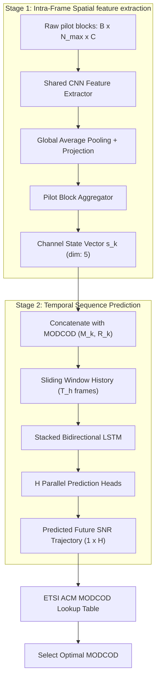

# Deep Neural Network for Channel Estimation in DVB-S2 GEO Links

This repository implements a **Two-Stage CNN + Bi-LSTM deep learning framework** for channel estimation and prediction over DVB-S2 Geostationary Earth Orbit (GEO) satellite links under Adaptive Coding and Modulation (ACM) optimization.

The framework extracts channel quality features from received pilots within a frame and utilizes temporal modeling to forecast channel SNR trajectories, allowing proactive and highly accurate ACM adjustments.

---

## 📖 Table of Contents
1. [Overview & Architecture](#-overview--architecture)
2. [Project Structure](#-project-structure)
3. [Key Modules & Symbol Index](#-key-modules--symbol-index)
4. [Prerequisites & Installation](#-prerequisites--installation)
5. [Dataset Requirements](#-dataset-requirements)
6. [Quick Start Guide](#-quick-start-guide)
   - [1. Data Preprocessing](#1-data-preprocessing)
   - [2. Model Training](#2-model-training)
   - [3. Inference & Prediction](#3-inference--prediction)
7. [Supported ACM Modes (ETSI Standard)](#-supported-acm-modes-etsi-standard)

---

## 🛰️ Overview & Architecture

GEO satellite links suffer from atmospheric propagation losses, specifically rain attenuation. Traditional reactive ACM schemes lag behind changing conditions, leading to outages or underutilized spectral efficiency. 

This model resolves this latency by performing two distinct stages:



### Stage 1: Intra-Frame Pilot Processing (CNN)
- Pilots within a DVB-S2 frame are grouped into $B = 22$ blocks of $N_{\max} = 36$ symbols (792 total pilot symbols per frame).
- A **shared Convolutional Neural Network (CNN)** processes each block individually to capture local channel characteristics (gain, attenuation, phase, and noise).
- A **Pilot Block Aggregator** concatenates the block-level representations and projects them into a 5-dimensional per-frame state vector: $s_k = [|H|, A_{\text{dB}}, \text{phase}, \text{SNR}, \sigma_n^2]$.

### Stage 2: Inter-Time Temporal Prediction (Bi-LSTM)
- The channel state vector is augmented with the current MODCOD metadata (Modulation Order $M_k$, Code Rate $R_k$).
- A sliding window history of length $T_h$ frames feeds into a **Stacked Bidirectional LSTM (Bi-LSTM)** network.
- **$H$ independent Dense heads** perform predictions to forecast the channel SNR for the next $H$ future time steps.
- The predicted SNR trajectory determines the optimal MODCOD configuration based on the ETSI standard lookup table.

---

## 📁 Project Structure

```text
Deep-Neural-Network-for-Channel-Estimation/
│
├── LICENSE
├── README.md                  # Project documentation (this file)
└── model/
    ├── preprocess.py          # CSV loading, block segmentation, and dataset splitting
    ├── model.py               # Two-stage CNN + Bi-LSTM Keras model architecture
    ├── train.py               # Model training script with GPU/CPU support
    ├── predict.py             # Inference, metrics evaluation, and plot generation
    ├── data/                  # Preprocessed .npz datasets (generated)
    ├── weights/               # Trained model weights & config JSONs (generated)
    └── results/               # Inference output files and visualization plots (generated)
```

---

## 🔍 Key Modules & Symbol Index

Below are references to the core implementation modules and their key classes/functions:

### Model Definitions
- [model.py](file:///e:/AVIONICS/Thesis/DNN/Deep-Neural-Network-for-Channel-Estimation/model/model.py): Core neural network structure and components.
  - [CNNFeatureExtractor](file:///e:/AVIONICS/Thesis/DNN/Deep-Neural-Network-for-Channel-Estimation/model/model.py#L20): Extracts spatial features from individual block structures.
  - [PilotBlockAggregator](file:///e:/AVIONICS/Thesis/DNN/Deep-Neural-Network-for-Channel-Estimation/model/model.py#L108): Aggregates block features across the entire frame.
  - [Stage1TimeDistributed](file:///e:/AVIONICS/Thesis/DNN/Deep-Neural-Network-for-Channel-Estimation/model/model.py#L201): Wraps Stage 1 to run efficiently across all time steps in parallel.
  - [BiLSTMPredictor](file:///e:/AVIONICS/Thesis/DNN/Deep-Neural-Network-for-Channel-Estimation/model/model.py#L269): Bidirectional LSTM forecasting future SNR trajectories.
  - [build_two_stage_model](file:///e:/AVIONICS/Thesis/DNN/Deep-Neural-Network-for-Channel-Estimation/model/model.py#L374): Combines Stage 1 and Stage 2 into a single TensorFlow Functional Model.
  - [build_stage2_only_model](file:///e:/AVIONICS/Thesis/DNN/Deep-Neural-Network-for-Channel-Estimation/model/model.py#L532): Lightweight model for instances where channel features are pre-computed.
  - [select_modcod](file:///e:/AVIONICS/Thesis/DNN/Deep-Neural-Network-for-Channel-Estimation/model/model.py#L629): ACM decision block mapping SNR predictions to MODCOD schemes.

### Preprocessing
- [preprocess.py](file:///e:/AVIONICS/Thesis/DNN/Deep-Neural-Network-for-Channel-Estimation/model/preprocess.py): Dataset preprocessor from MATLAB-exported CSV format.
  - [preprocess](file:///e:/AVIONICS/Thesis/DNN/Deep-Neural-Network-for-Channel-Estimation/model/preprocess.py#L376): Orchestrates the entire preprocessing workflow.
  - [load_csv](file:///e:/AVIONICS/Thesis/DNN/Deep-Neural-Network-for-Channel-Estimation/model/preprocess.py#L82): Loads CSV and parses columns.
  - [build_pilot_blocks](file:///e:/AVIONICS/Thesis/DNN/Deep-Neural-Network-for-Channel-Estimation/model/preprocess.py#L141): Groups pilot symbols into blocks, adds zero padding, and generates masks.

### Training & Inference
- [train.py](file:///e:/AVIONICS/Thesis/DNN/Deep-Neural-Network-for-Channel-Estimation/model/train.py): Script to execute the training loop.
  - [train](file:///e:/AVIONICS/Thesis/DNN/Deep-Neural-Network-for-Channel-Estimation/model/train.py#L186): Manages dataset loaders, compiles selected models, sets up callbacks, and saves training artifacts.
  - [setup_gpu](file:///e:/AVIONICS/Thesis/DNN/Deep-Neural-Network-for-Channel-Estimation/model/train.py#L43): Detects and configures hardware acceleration.
- [predict.py](file:///e:/AVIONICS/Thesis/DNN/Deep-Neural-Network-for-Channel-Estimation/model/predict.py): Evaluation and plotting script.
  - [predict](file:///e:/AVIONICS/Thesis/DNN/Deep-Neural-Network-for-Channel-Estimation/model/predict.py#L235): Loads trained checkpoints, runs predictions, and serializes results.
  - [compute_metrics](file:///e:/AVIONICS/Thesis/DNN/Deep-Neural-Network-for-Channel-Estimation/model/predict.py#L68): Evaluates prediction accuracy via MSE, MAE, and RMSE.
  - [plot_predictions](file:///e:/AVIONICS/Thesis/DNN/Deep-Neural-Network-for-Channel-Estimation/model/predict.py#L128): Produces time-series prediction curves and error distribution histograms.

---

## 🛠️ Prerequisites & Installation

### Requirements
- **Python**: `3.9` to `3.11` is recommended.
- **Hardware**: Compatible with both GPU and CPU. Note that training the model on CPU may require a smaller batch size or sequence history window to prevent out-of-memory (OOM) errors.

### Installation
1. Clone the repository:
   ```bash
   git clone https://github.com/jamee47/Deep-Neural-Network-for-Channel-Estimation.git
   cd Deep-Neural-Network-for-Channel-Estimation
   ```

2. Install dependencies:
   ```bash
   pip install -r requirements.txt
   ```

---

## 📊 Dataset Requirements

The preprocessor expects a CSV dataset exported from MATLAB containing per-frame pilot symbols and channel parameters.

Required CSV columns include:
- `pilot_re_1` ... `pilot_re_P`: Real part of $P$ received pilot symbols (typically $P=792$).
- `pilot_im_1` ... `pilot_im_P`: Imaginary part of $P$ received pilot symbols.
- `H_true_re`, `H_true_im`: Ground truth channel response coefficient.
- `snr_dB`: Channel SNR in dB.
- `nVar`: Linear noise variance.
- `modcod`: MODCOD index.
- `rainAtt_dB`: Rain attenuation in dB.

---

## ⚡ Quick Start Guide

### 1. Data Preprocessing
Parse, segment, normalize, and divide your dataset into training/validation/testing subsets:

```bash
# Preprocess in lightweight stage2 mode (pre-extracted channel features)
python model/preprocess.py --csv_path "path/to/channel_dataset.csv" --mode stage2

# Preprocess in full mode (extract raw pilot blocks for CNN)
python model/preprocess.py --csv_path "path/to/channel_dataset.csv" --mode full --num_blocks 22 --n_max 36
```

### 2. Model Training
Train the CNN + Bi-LSTM network. The training script automatically detects and utilizes GPUs:

```bash
# Train the default stage-2 Bi-LSTM model
python model/train.py --model stage2 --data_dir model/data --epochs 100 --batch_size 32

# Train the full Two-Stage CNN + Bi-LSTM model
python model/train.py --model full --data_dir model/data --epochs 100 --batch_size 16

# Resume training from a previous checkpoint
python model/train.py --model stage2 --resume model/weights/best.weights.h5
```

### 3. Inference & Prediction
Load the trained weights to run predictions on the test partition, compute metrics, and visualize results:

```bash
# Evaluate model predictions
python model/predict.py --weights model/weights/best.weights.h5 --data_dir model/data

# Run evaluation and generate visualization plots (stored in model/results/)
python model/predict.py --weights model/weights/best.weights.h5 --plot --sample_indices 0 10 50
```

---

## ⚙️ Supported ACM Modes (ETSI Standard)

During inference, the model checks each future step prediction against the following AWGN-channel ETSI table (for $10^{-6}$ Packet Error Rate) to select the maximum possible modulation/coding efficiency:

| Modulation | Code Rate | Required $E_s/N_0$ (dB) |
| :--- | :---: | :---: |
| **QPSK** | 1/4 | -2.0 |
| **QPSK** | 1/2 | 0.0 |
| **QPSK** | 3/4 | 1.8 |
| **QPSK** | 2/3 | 4.0 |
| **8PSK** | 3/4 | 5.0 |
| **8PSK** | 5/6 | 6.0 |
| **8PSK** | 2/3 | 7.5 |
| **16APSK** | 3/4 | 8.8 |
| **16APSK** | 5/6 | 9.8 |
| **16APSK** | 3/4 | 12.0 |
| **32APSK** | 3/4 | 13.5 |
| **32APSK** | 5/6 | 15.0 |
| **32APSK** | 8/9 | 15.0 |
| **32APSK** | 9/10 | 13.0 |